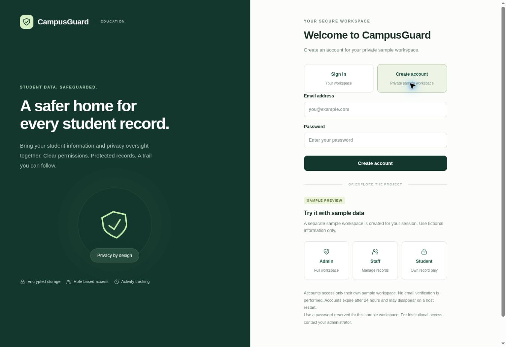
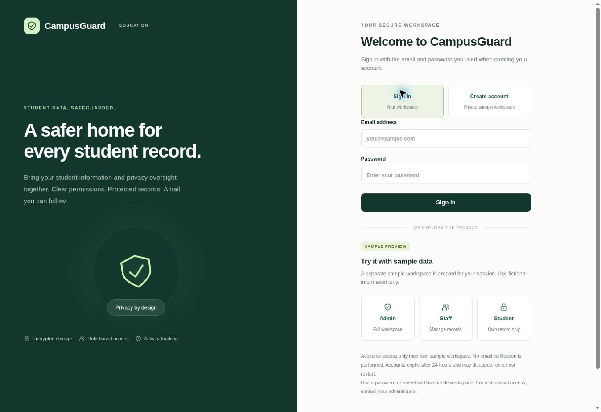
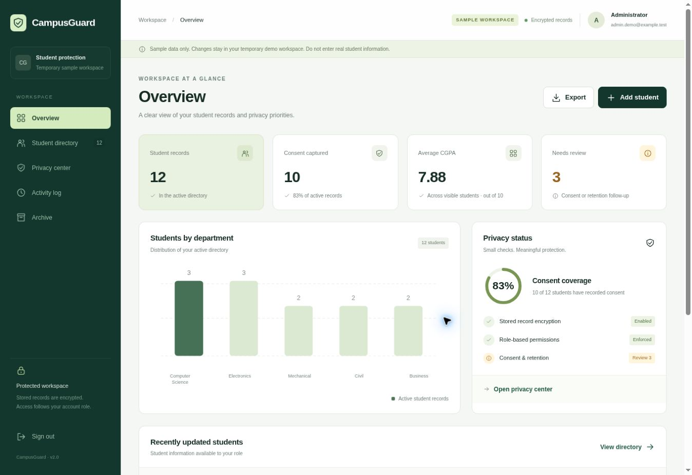
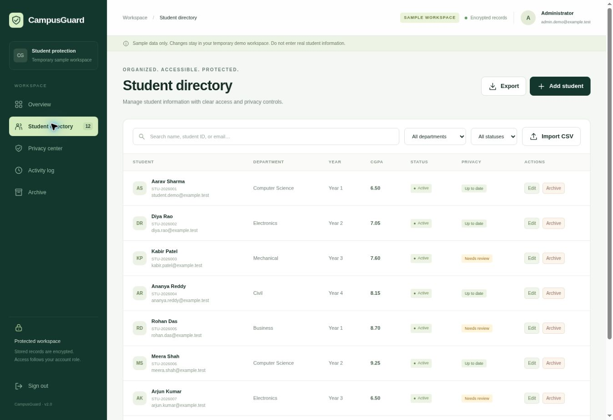
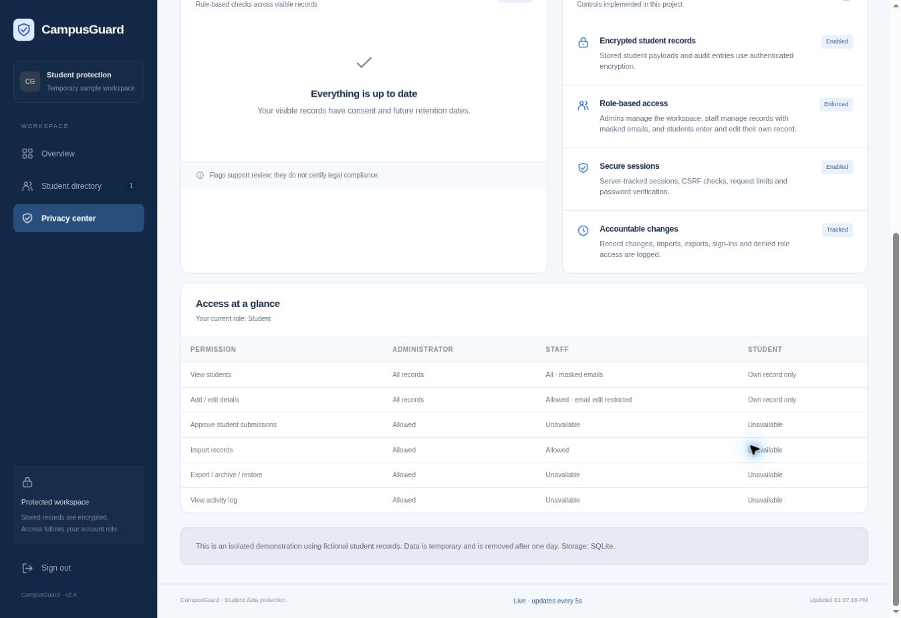

# CampusGuard — Cloud-Based Student Data Protection

A Flask application for managing student records with a responsive dashboard, encrypted storage, role-based permissions, and privacy review tools.

## Live project

**[Open CampusGuard](https://campusguard-student-protection.onrender.com/)**

Choose **Create account**, select **Student**, **Staff**, or **Admin**, then **Sign in**, or explore the **Admin**, **Staff**, and **Student** previews with fictional records. The free host may take about a minute to wake up. Hosted accounts and sample records are temporary: they expire after 24 hours and may disappear on a restart or redeploy.

## Screenshots

These screenshots show an earlier interface using fictional sample data. The live app now has mandatory Student and Staff campus codes and a live account directory.

| Create account | Sign in |
| --- | --- |
|  |  |

### Workspace overview



### Student directory



### Privacy center



## Sample video

**[Watch or download the earlier project walkthrough](campusguard-walkthrough.mp4)**

[](campusguard-walkthrough.mp4)

This repository video shows an earlier interface. Use the live project to explore the latest role-specific campus invitations and account visibility.

## Features

- Admin-only **Registered accounts** with names, emails, saved roles, registration times, linked student IDs, and Online / Idle / Offline presence.
- Separate **Student** and **Staff** campus codes appear immediately after Admin signup, each with its own Copy button. Codes remain available under **Registered accounts** after sign-in.
- Automatic updates every five seconds, preserved search filters, reconnect status, and paused updates while editing a record.
- Student enrollment is bound to an account ID. Students can only view their own enrolled record; other Admin campuses and private workspaces remain separate.
- New enrollment profiles await Admin review. Pending grades and academic fields are displayed and exported as blank, and excluded from CGPA averages.

- Professional navy and blue interface with consistent contrast, buttons, and role cards.
- Student, Staff, and Admin account signup with saved roles and role-specific success messages.
- Full name, password confirmation, password visibility, and personalized sign-in welcome.
- Student signup requires the Student campus code and links a record to the account ID. Staff signup requires the Staff code, preserves email masking, and cannot export, archive, or view account/activity logs.

- Dashboard with student totals, department distribution, consent coverage, average CGPA, and privacy follow-up.
- Searchable directory with department/status filters and pagination.
- Add/edit records with server validation; unique student IDs.
- Three enforced roles: administrator, staff, student.
- Staff email masking; students see only records matched to their provisioned account email.
- Encrypted student payloads and encrypted activity entries at rest using Fernet authenticated encryption.
- CSV import (1–100 records), validated before an atomic write; CSV export with email redaction by default and formula-injection protection.
- Consent tracking and retention review dates, with explicit rule-based flags.
- Reversible archive/restore; no permanent deletion through the application.
- Read-only activity log for sign-ins, directory/record views, mutations, denied role access, imports, and exports.
- CSRF validation, server-revocable sessions, 30-minute inactivity expiry, request limits, HTTP-only cookies, and security headers.
- Separate temporary demonstration workspace for every demo sign-in, with fictional records and selectable roles.
- Optional Firebase Authentication / Firestore integration for cloud use.

Privacy flags help an administrator review records. They do not establish legal compliance. Encryption at rest is not end-to-end encryption: the authorized server can decrypt records.

## Admin visibility and live enrollment

1. Create an **Admin** account. The success panel immediately shows two different codes: **Student campus code** (`CG-STU-…`) and **Staff campus code** (`CG-STF-…`). Each has its own Copy button.
2. Share the Student code with students and the Staff code with staff. A Staff code grants record-management access, so share it only with authorized staff.
3. New accounts choose **Student** or **Staff**, enter the matching **required** campus code, and finish signup. The wrong role's code, a missing code, or an expired code is rejected before the account is created. Admin signup requires no code and creates its own campus.
4. The Admin signs in and opens **Registered accounts** to copy either code again and view all enrolled Student and Staff accounts. New registrations appear automatically within **5 seconds**, even before the new user signs in. The student directory and overview update too.
5. Existing personal Student or Staff accounts created in earlier versions can choose **Join Admin campus** after signing in, using their role's code. Existing Student codes from version 2.2 keep working; migration adds a separate Staff code.

Passwords and password hashes are never sent to the directory. Online means authenticated activity within 20 seconds; Idle means a still-valid session without recent activity; signing out shows Offline. Updates pause in hidden tabs and while a record dialog is open. Search remains intact during updates.

A Student code cannot grant Staff or Admin access, and a Staff code cannot create a Student account. Admin signup cannot join someone else's campus. Staff can manage records with masked emails, but cannot list registered accounts, export, archive, or view activity logs. Other Admin campuses remain separate. Public previews never list signup accounts or expose working campus invitation codes. Firebase institutional provisioning remains separate from this temporary signup portal.

Campus enrollments are part of the temporary hosted portal. They expire no later than their Admin's 24-hour workspace expiry, and free-host redeploys/restarts can clear them. Use persistent storage and verified institutional provisioning before storing real student records.

## Account signup and sign-in

Choose **Create account**, enter your full name, select Student / Staff / Admin, enter the role-specific campus code for Student or Staff, and enter your email with a confirmed password reserved for this sample portal. Admin signup displays both codes immediately; then choose **Sign in**. The saved role controls every request and cannot be upgraded by changing the login payload. Students view their own account-linked record; staff view and manage campus records with masked emails; Admins view enrolled accounts and administration tools. Passwords are salted and hashed. Signup accounts cannot access institution records. The portal has no email ownership verification and uses temporary data: accounts expire after 24 hours or the Admin's earlier campus expiry, and host restarts/redeploys may clear them. Do not enter real student data. Institutional accounts remain administrator-provisioned.

## Quick start

Requires Python 3.12. Create a virtual environment, install dependencies, then launch:

```bash
python -m venv .venv
# Windows: .venv\Scripts\activate
# macOS/Linux: source .venv/bin/activate
pip install -r backend/requirements.txt
python backend/app.py
```

Open `http://localhost:5000`. Select **Admin**, **Staff**, or **Student** under **Sample preview**. No passwords or external services are needed for the fictional demonstration. The student demo displays one record; staff emails are masked. Each new demo sign-in starts a fresh dataset. Temporary demo data is purged after one day when a subsequent demo session starts, and can disappear earlier if a free host restarts.

For a real local workspace, provision accounts through the administrator-controlled CLI (verify the recipient's institutional email yourself first):

```bash
cd backend
python -m flask --app app create-admin
python -m flask --app app create-user
```

These commands prompt privately for passwords. Self-registration is intentionally closed: allowing anyone to claim a student's email would expose that student's record. Use a verified institutional email for each student account.

## Deploy on Render

The included `render.yaml` configures a free Python web service with Gunicorn and a health check. The default deployment is an explicitly labeled sample-data demonstration.

1. Commit this source to your GitHub repository.
2. Sign in to Render and create a **Blueprint** from that repository, using `render.yaml`.
3. Confirm the service uses the **Free** instance type.
4. Render generates `SECRET_KEY` and `ENCRYPTION_KEY`; do not paste keys into source code or chats.
5. Wait for a successful deployment, then open the URL returned by Render. Verify `/api/health` and all three demo roles.

Manual web-service settings if you are not using a Blueprint:

| Setting | Value |
| --- | --- |
| Runtime | Python 3 |
| Build command | `pip install -r backend/requirements.txt` |
| Start command | `cd backend && gunicorn --no-control-socket --bind 0.0.0.0:$PORT --workers 1 --threads 4 --timeout 60 app:app` |
| Health check | `/api/health` |
| APP_ENV | `production` |
| DEMO_MODE | `true` |
| SECRET_KEY | Separate randomly generated secret, at least 32 characters |
| ENCRYPTION_KEY | Separate randomly generated secret, at least 32 characters |

Render's free web services sleep when idle and lose local files on restarts/redeploys. Therefore, free SQLite hosting is suitable for the demonstration, not real student records. See [Render free-service limits](https://render.com/docs/free) and [Flask deployment](https://render.com/docs/deploy-flask). The public live project is linked above; institutional Firebase access is not configured on that sample deployment.

## Real cloud records with Firebase

Before entering any real information:

1. Create a Firebase project with Firestore and Email/Password Authentication.
2. Deploy `firebase/firestore.rules` to deny direct browser access. The Flask Admin SDK performs authorized server operations. Server IAM must separately restrict credentials.
3. Provision and verify user emails. Assign `role` custom claims (`admin`, `staff`, `student`) from a trusted administrator environment. Unrecognized/missing roles default to student.
4. Configure `FIREBASE_CREDENTIALS_JSON` privately in the hosting environment using the service account JSON, and `FIREBASE_WEB_API_KEY` from your Firebase project.
5. Set `DEMO_MODE=false`, `APP_ENV=production`, and configure separate persistent `SECRET_KEY` and `ENCRYPTION_KEY` values.
6. Run a staging deployment with disposable records to verify Firebase authentication, revoked accounts, role claims, Firestore writes, and recovery. Firebase was not connected or tested against a live project in this delivery.

Firebase sign-in uses its password-authentication endpoint, verifies the returned ID token with revocation checking, and requires verified email. Later requests fetch current user state and roles, honoring disabled accounts and token revocation. Student and audit records persist in Firestore, while sessions/rate limits stay in local SQLite. A host restart intentionally signs users out. This implementation targets one institution and one server instance; distributed rate limiting and multi-institution tenancy are outside its current scope.

Local real-data hosting instead requires a persistent `DATA_DIR` and `PERSISTENT_STORAGE=true`. Production startup rejects missing secrets and ephemeral real-data configuration. Protect the encryption key: losing it makes stored records unreadable. Key rotation and an institutional backup/deletion policy must be managed before operational use.

## Project structure

```text
backend/
  app.py                 Flask application factory, security, CLI
  config.py              Environment settings and startup safeguards
  routes/auth.py         Verified account / demo session routes
  routes/students.py     Records, privacy metrics, import/export, audit
  services/store.py      Encrypted SQLite/Firestore record storage
  services/auth_service.py Password verification and session lifecycle
  utils/validation.py    Student validation and privacy flags
  templates/index.html   Responsive dashboard and sign-in interface
  static/                CSS, JavaScript, SVG favicon
firebase/firestore.rules
render.yaml
.env.example
tests/test_app.py
```

## Validation

```bash
pip install -r requirements-dev.txt
python -m pytest tests -q
node --check backend/static/app.js
# Optional DOM/API interface checks (Node 22+):
npm install
python tests/run_ui_checks.py
python tests/run_ui_checks.py campus_live.cjs
```

The security/integration suite covers authentication, CSRF, account privilege restrictions, per-session demo isolation, staff masking, student ownership, validation, CSV atomicity, formula protection, encryption at rest, archive/restore, activity logging, revocation, live role changes, request throttling, and disabling demo access.

The additional interface check exercises the real Gunicorn API through a simulated DOM (jsdom): demo sign-in, search, pagination, add/edit, archive/restore, privacy, activity, sign-out, staff masking, student restrictions, and quoted CSV parsing. It does not replace visual browser testing. All 48 backend tests and the interface integration checks passed. Live verification covers immediate separate invitations, mandatory role-specific codes, registration visibility, presence, Staff masking, and Admin-only permissions. The deployed desktop interface was visually checked in a browser; the updated signup screenshots are included in the downloadable package; repository images above show an earlier interface. Mobile rendering has not been separately verified. Verify campus enrollment with `python tests/check_live_campus.py https://campusguard-student-protection.onrender.com` (four temporary fictional accounts). Re-run the live role checks using `python tests/check_live_roles.py https://campusguard-student-protection.onrender.com` (this runs the same four-account campus checks).

## API

All writes require the session's `X-CSRF-Token`, returned by `GET /api/session`. Role authorization is enforced on the server.

| Route | Method | Purpose |
| --- | --- | --- |
| `/api/health` | GET | Health/version |
| `/api/session` | GET | Session, CSRF token, capabilities |
| `/api/login`, `/api/logout` | POST | Authentication/session revocation |
| `/api/demo` | POST | Isolated fictional sample preview |
| `/api/demo/signup`, `/api/demo/login` | POST | Temporary account creation / password sign-in |
| `/api/accounts` | GET | Admin-only campus account directory and campus code |
| `/api/campus/join` | POST | Enroll an existing Student or Staff signup account |
| `/api/presence` | GET | Authenticated activity heartbeat |
| `/api/students` | GET, POST | Directory / new student |
| `/api/students/<id>` | GET, PUT, DELETE | Detail / edit / reversible archive |
| `/api/students/<id>/restore` | POST | Restore an archive |
| `/api/overview` | GET | Role-scoped metrics and privacy flags |
| `/api/audit` | GET | Administrator activity log |
| `/api/import` | POST | Atomic validated import |
| `/api/export` | GET | Logged administrator CSV export |

## Original upload security note

An API credential embedded in the original README was removed. The exposed original credential should be revoked at its provider; removing it from this package does not revoke it or erase old repository history. No credentials, database files, or runtime-generated keys are included in the upgraded archive.

## References

- [Flask security](https://flask.palletsprojects.com/en/stable/web-security/)
- [Firebase ID-token verification](https://firebase.google.com/docs/auth/admin/verify-id-tokens)
- [Firebase custom claims](https://firebase.google.com/docs/auth/admin/custom-claims)
- [Fernet authenticated encryption](https://cryptography.io/en/stable/fernet/)

This is an engineering project, not a compliance certification. Real-data use needs institutional approval, access provisioning, tested recovery, and a retention/deletion process.
